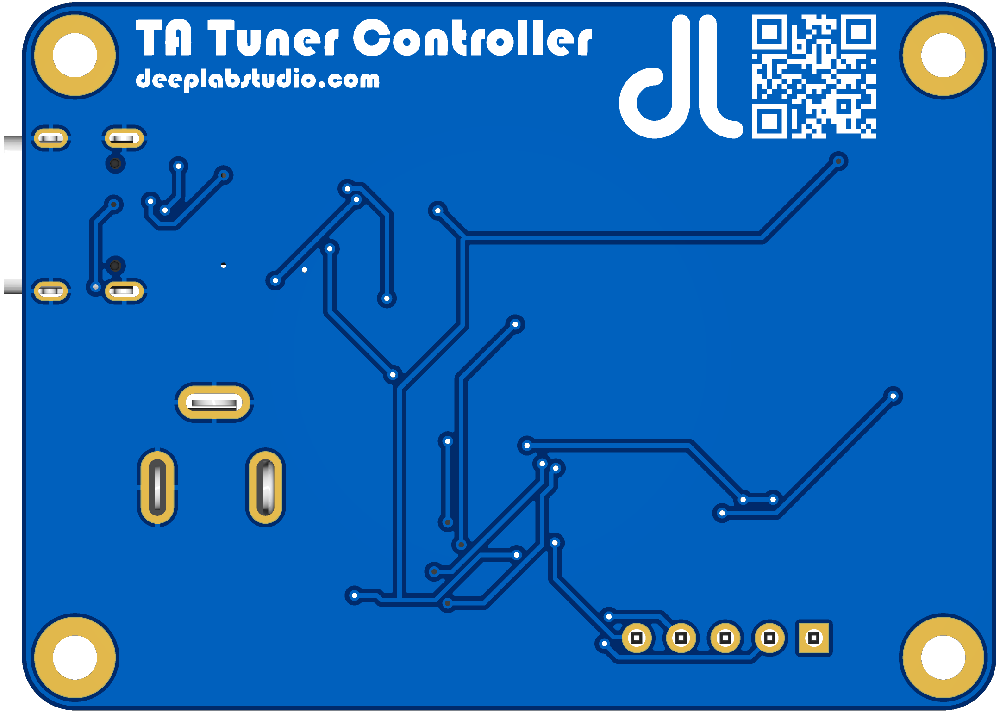
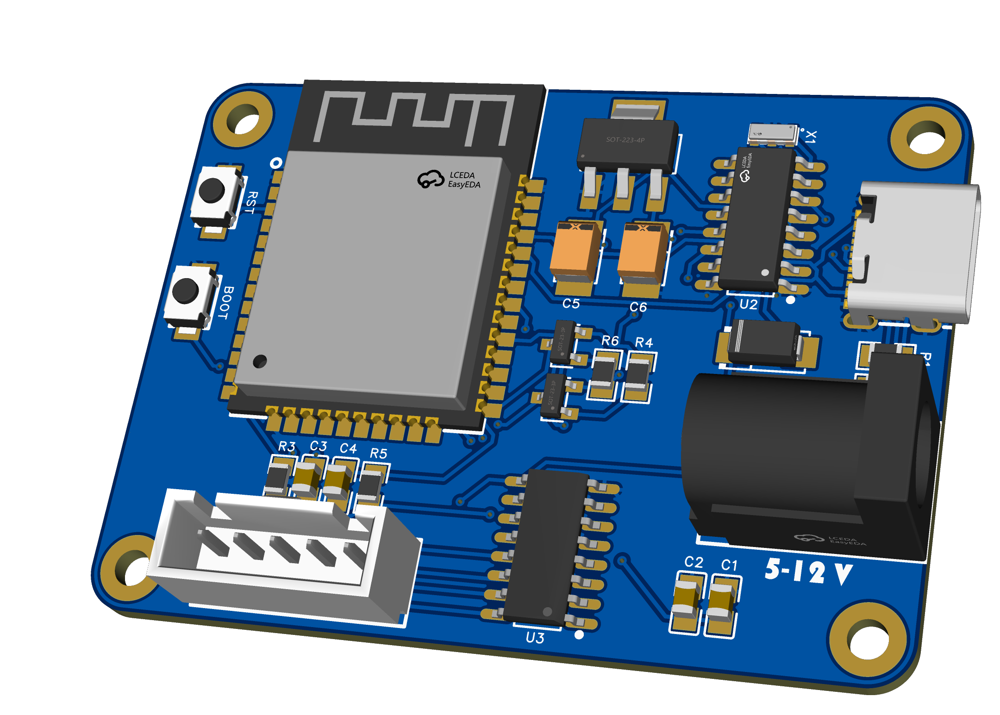

# TA-Tuner-Controller

[Türkçe için tıklayınız](README.md)

This project is a remote tuner system that allows you to control variable capacitors via WiFi using an ESP32 and a stepper motor.

## Features

*   **WiFi Access Point (AP):** The device creates its own WiFi network ("TA-Tuner-Controller"), so no external modem is needed.
*   **Web-Based Control:** User-friendly interface accessible via any browser (phone, tablet, or PC).
*   **Precise Motor Control:** AccelStepper library is used for precise forward/backward driving of the stepper motor.
*   **OTA Update:** The device software can be updated wirelessly (via `/update` page).

## Hardware Requirements

*   **Microcontroller:** ESP32 (ESP32-DevKitC V1 etc.)
*   **Motor:** 28BYJ-48 (5V) Stepper Motor
*   **Driver:** ULN2003 Stepper Motor Driver Board
*   **Capacitor:** Suitable Variable Capacitor for MLA Antenna
*   **Power Supply:** Suitable power supply for ESP32 and Motor (e.g. 9-12V Battery)

## Connection Diagram

The pin connections defined in the software are as follows:

| ULN2003 Driver | ESP32 GPIO |
| :--- | :--- |
| IN1 | 19 |
| IN2 | 18 |
| IN3 | 5 |
| IN4 | 17 |
| + (5V - 12V) | VIN / 5V |
| - (GND) | GND |

> **Note:** If the motor rotation direction is reversed, you can change the pin order or the connection sequence in the code.

## Installation and Usage

1.  **Installing the Software:**
    *   Download the project to your computer.
    *   Open the project in Visual Studio Code with the PlatformIO extension.
    *   Connect your ESP32 board and click the "Upload" button to load the software.

2.  **Connection:**
    *   Power on the device.
    *   Scan for WiFi networks from your computer or phone.
    *   Connect to the `TA-Tuner-Controller` network.
    *   Password: `deeplabstudio`

3.  **Control:**
    *   Open your web browser and type `192.168.4.1` in the address bar.
    *   Adjust the antenna by moving the motor in the desired direction and step count from the interface that opens.

## Gallery

Below are the 3D design and example assembly images of the project:

